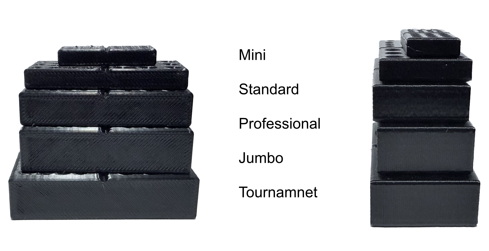
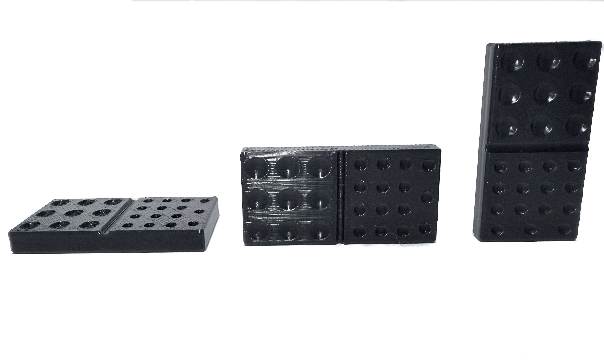
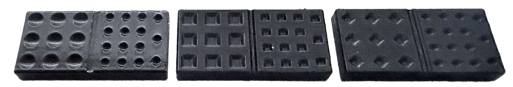
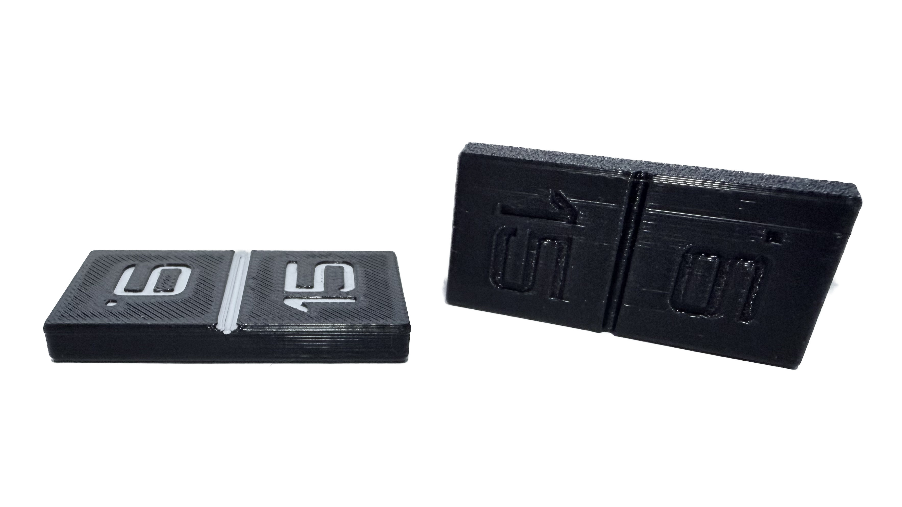
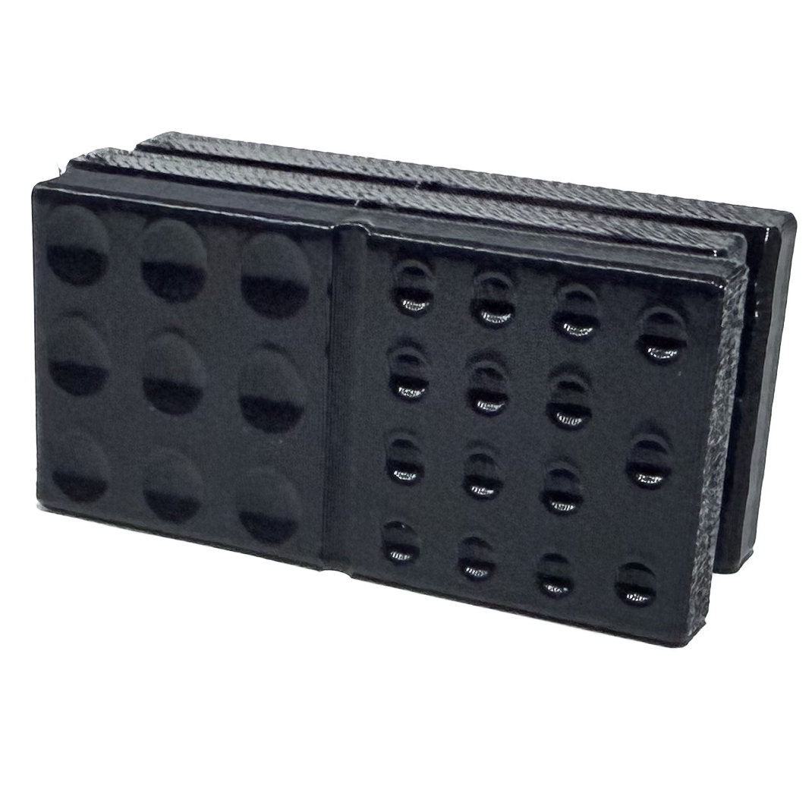
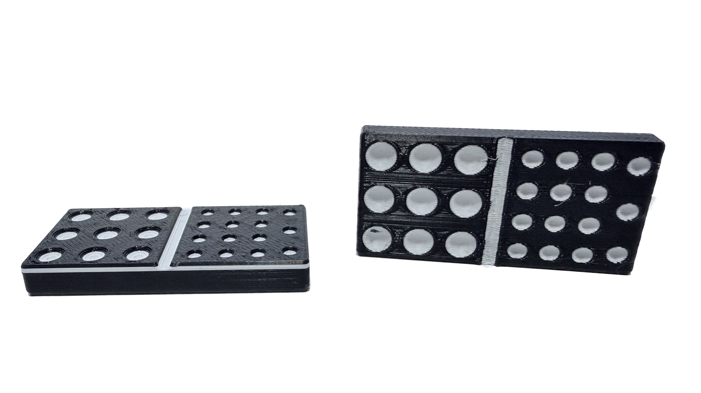

# Customizable Dominos - Domino Tiles Set

Dynamically generated domino sets with options for the set size, domino size, print optimized orientations, and various types of pips or numerals.

The OpenSCAD file can be used directly with all options exposed in the Customizer, or prebuilt STL or 3MF files are in the dist directory.

The following first explains all the options, provides details on coloring the domino tiles, and finally some suggestions on optimizing the printing.

## Sets

There are five different set sizes for dominos denoted by the highest double in the set:

| Name | Tile Count |
| --- | --- |
| DoubleSix | 28 |
| DoubleNine | 55 |
| DoubleTwelve | 91 |
| DoubleFifteen | 136 |
| DoubleEighteen | 190 |

## Sizes

There are five different standard sizes for dominos:

| Name | Size (mm) |
| --- | --- |
| Mini | 30 x 14 x 5 |
| Standard | 48 x 24 x 6 |
| Professional | 50 x 25 x 10 |
| Jumbo | 50 x 25 x 13 |
| Tounament | 55 x 28 x 13 |

In the Customizer:

+ To set a custom size, select Custom from the Size dropdown and the enter your custom size in the CustomSize field.
+ The with of the divider between the halves of the tile can be modified with the DividerDiameter field
+ The depth of the divider (and pips, if used) can be adjusted using the cDepth field

## Layouts

There are four different layouts for arranging the tiles:

| Name | Description |
| --- | --- |
| Simple | A simple visual layout that does not consider Bed Size. Orientation matches Grid - Flat. |
| Grid - Flat | Tiles laid out on their back and arranged to fit within a bed size |
| Grid - Horizontal | Tiles laid out on their long side and arranged to fit within a bed size |
| Grid - Vertical | Tiles laid out on their short side and arranged to fit within a bed size |

Edge rounding adjustments are made to support the tile orientation of each layout.

[!NOTE]
OpenSCAD generates the entire set as one object. Once you import the model in the slicer, use "Split to Objects" to separate the tiles. Create the neccessary number of plates for the set size. Select the block of tiles for a plate and move it to that plate in the slicer.

In the Customizer:

+ BedSize can be changed to support any X,Y size for use by the layout function
+ TileSpacer can be adjusted to add or remove space between tiles. This can be useful in Grid - Vertical to ensure there is brim space or to increase density if desired.
+ PlateSpacer can be adjusted to add or remove space between the groups of tiles.

## Markings

The domino tiles can be marked using pips (dots) or numerals. There are different options for each.

### Pips

Pips come in two types: divets and holes. _Divets_ are better if you are going to use the tiles bare, paint by hand, or paint in the slicer. _Holes_ are better if you are going to print pips separately and insert them into the tiles. See the Coloring section below for more on this topic.

Pips come in three shapes: round, square, and diamond.

Pips are dynamically sized based on the number of pips on the tile and the size of the tile. 

In the Customizer:

+ PipSpacing can be configured to make the pips larger and more dense or smaller and more spreadout. The value is a percentage of the calculated pip size.
+ SamePipSize can be set to true to use the smallest required pip size for the set on all tiles. (This can be especially helpful if you are using the holes setting and want all the inserts to be the same size.)
+ PipEdgeMargin can be used to increase or decrease the offset used to calculate the area for the pips to occupy.

### Numerals

With numerals, the numbers can be printed directly onto the tiles.

By default the numeral setting uses Orbitron as the font.

In the Customizer:

+ Use the NumberFont field to specify a font for the numerals
	+ If customizing on the web, any font from Google Fonts can be selected but take care to use something that is printable
	+ If customizing on your local machine in OpenSCAD, enter any valid font name. Check Help > Font List for a complete list of what OpenSCAD can see.
+ Use the NumberSize field to specify a font size. The same size is used on all tiles. Make sure to select a size that fits.
+ Use NumberSet to select from different number formats:
	+ Plain: Blank for zero, otherwise no formatting.
	+ Standard: Blank for zero, "6." and "9." for differentiation.
	+ Zeroed: "00" for zero, then all single digits have a preceeding zero (e.g. 01, 02, etc)
	+ Custom: Enter any string you want for any of the numbers. You can really use any string if the characters are supported by your font choice.  Use Webdings and go crazy as long as its printable.

## Coloring

There are several options available for coloring the pips or numerals.  They all have some pros and cons which are a mix of cost, time, and complexity.

### Bare Tiles

Depending on the filament selected for the print, you may not need to color the markings on the dominos and can use them bare. Selecting a more matte filament would be beneficial as anything with a particularly glossy filament may be hard to easily differentiate.

### Hand Painted

The set can be printed bare and then painted by hand. If a unique color is desired per number then this may be the most reasonable depending on your printer setup.

There are a number of acrylic paint markers available that would make this easier, but any model painting method you prefer works great too.

### Pip Inserts

As an alternative to multicolor printing or hand painting, configure a set using the pips with the hole type. This will allow the tiles to be printed in one color and small pip inserts to be generated in one or more alternate colors. The inserts can then be press fit (or glued if you prefer) into the tiles.

### Two Tone Multicolor with Layer Swap

Another option for coloring is to have one primary color for the body and an alternate color for all the pips and the divider. Using a layer swap will create a stripe of the alternate color on the exterior walls, but its very easy to configure and minimizes purge waste.

The following assumes OrcaSlicer or similar (Bambu Slicer, Creality Print, Prusa Slicer, etc.).

Download a file with the Grid - Flat layout, or generate a set using this layout. Open the model in your slicer. Arrange and configure as desired, then slice the model.

_For Pips_

On the preview screen, drag the top layer selector down to identify the first layer where the pips begin to print. Right click the layer selector, choose Change Filament, and select your alternate color. Drag the top layer selector back up until the second to last or last layer. Right click the layer selector, choose Change Filament, and select your original color.

_For Numerals_

On the preview screen, drag the top layer selector down to identify the first layer where the numerals begin to print. Right click the layer selector, choose Change Filament, and select your alternate color. Drag the top layer selector back up until the first layer of the numeral cutout. Right click the layer selector, choose Change Filament, and select your original color.

Repeat this process for each plate ensuring you select the same layers on all plates.

If you do not have a multi-extruder printer, a prime tower will likely be added by the slicer. Ensure adequeate space is available for the tiles and shift tiles to an alternate plate or adjust the prime tower settings as needed.

### Slicer Painting

The most time consuming options is to paint the tiles in the slicer for the markings. Depending on your slicer, this is not a complicated process, but there are a of tiles and a lot of markings. Here is my recommended approach.

The following assumes OrcaSlicer or similar (Bambu Slicer, Creality Print, Prusa Slicer, etc.).

1. On the Prepare tab, select a tile and then select the Color Painting action
2. Configure color painting as follows
	1. Select the filament color you want to use for the paint
	2. Select the Fill tool
	3. Select/Enable Edge Detection
	4. Select a Smart Fill angle that works, 30 is usually fine.  Go down to 10 if you want to be more granular
3. As you move the mouse over the model, you'll see if automatically selects the pips and dividers.  Click each to paint it with the specified color.
	+ You can hold down Shift and click to remove a color if you click the wrong spot
4. Repeat for each tile

[!IMPORTANT] 
A prime tower will likely be added by the slicer when using multiple colors. Ensure adequeate space is available for the tiles by shifting tiles to an alternate plate or adjust the prime tower settings or location as needed.

## Generated File Settings

The following settings were used to generate the posted models.

| Size | DividerDiameter | PipEdgeMargin | NumberSize[^1] |
| --- | --- | --- | --- |
| Mini | 2 | 1 | 6 |
| Standard | 2.5 | 2 | 10 |
| Professional | 2.5 | 2 | 10 |
| Jumbo | 2.5 | 4 | 10 |
| Tournament | 2.5 | 4 | 12 |

[^1]: The correct NumberSize value is directly related to the font choice. [Orbitron](https://github.com/theleagueof/orbitron) is the default font and used in all the pre-generated files. Changing the font will require adjusting the NumberSize value.

| PipType | SamePipSize |
| --- | --- |
| Divet | false |
| Cutout | true |

## Printing

### Filament

You can use any filament to print the tiles. My recommendation is to consider how often you want to use them and how delicate your players are and choose something accordingly.  For example, if you have a Silk PLA you think would be beautiful but it breaks easily, then that may not be the best choice for a set you plan to use often.

### Print Settings

The standard print settings that you prefer for your choosen filament will usually work fine.

If you see any irregularities around the pips, consider lowering your outer wall acceleration and/or jerk settings. If you're seeing gaps leading up to the pips, consider tuning your Pressure Advance setting if enabled.

If you are printing tiles in the vertical orientation using one of the skinnier sizes (e.g. Mini, Standard) you may want to add a brim depending on how well your filament is adhereing to your bed.

If you want the tiles to have a little more weight to them, dial up your infill percentage.

### Orientation

The models are generated to be printed in a certain orientation. Rotating them to a different orientation in the slicer may yield undesirable results.

To avoid any identifying differences in the tiles, ensure the tiles all face the same direction on the build plate. For example, if printing in Horizontal or Vertical orientation ensure the Pips are always facing the same way.  If some tiles print at an angle, or with a different side facing forward the subtle differences in print speed or movement may leave a different sheen or color on the back of the tiles.  This can effect game play as it may "mark" certain tiles.

## Related Models

The Customizable Dominos set includes the following components:

1. Domino Tiles Set - A configurable set of dominos with many options.
2. Domino Tile Tray - A tray for domino tiles with custom sizing and features.
3. Domino Tile Hub - A hub for playing Mexican Train and similar domino games.
4. Domino Train - A simple to print train token for playing Mexican Train.

Use some or all of the models to build a completely custom set or add extras to an existing set.

The models are all available on my GitHub page as well as a number of profiles on MakerWorld, Creality Cloud, etc.

## License

[Customizable Dominos](https://github.com/myname-random/dominos) © 2025 by [Morgan Conner](https://github.com/myname-random/) is licensed under [CC BY-NC-SA 4.0](https://creativecommons.org/licenses/by-nc-sa/4.0/)

